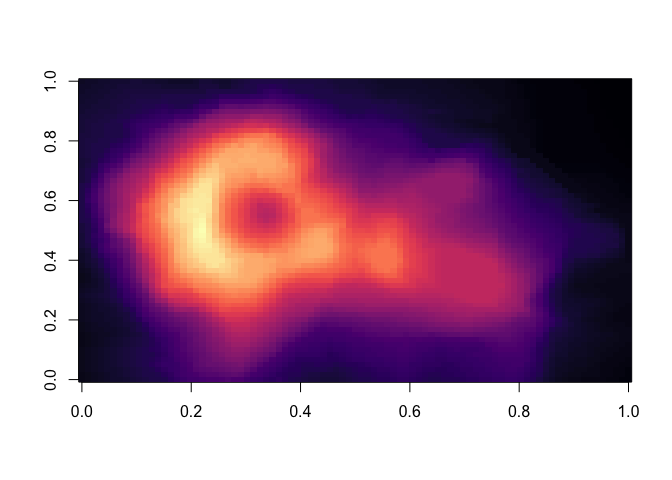

## How to Start

1.  You should have a working version of RStudio (From within RStudio,
    go to Help &gt; Check for Updates to install newer version of
    RStudio (if available).)
2.  Install and load Rmarkdown with `install.packages("Rmarkdown")` and
    `library(rmarkdown)`
3.  You will be asked to give some information, that information will
    show up in your YAML header (which is some kind of human readable
    non-markup format)
    -   Important: the header can tell `render()` what to output –&gt;
        html for example
4.  Toggle the visual mode if you want.

## Basics

### Flavor

Rmarkdown has not the same “flavor” as GitHub Markdown… So unfortunately
you will have to use a slightly different syntax for some things. - you
have to use 4 spaces to indent a list element.

### Code blocks:

-   create code-blocks as you would do in normal Markdown.
-   The difference is, that you can have actual executable code blocks
    in your R-Markdown file and decide if to render everything, just the
    results, just the plots or nothing.
-   You have to declare a language in a `{r}` curly brackets syntax for
    this.

<!-- -->

    ` ```{r, include=True, echo=False}
    # This is an R code block, which will be included in the rendered output file. 
    # ... It would not show the source code but the result/output/plot
    # ... you only need three ``` , the first one is necessary here
    # ... to escape within the actual code block.
    ` ```

You can also embed plots, for example:


Note that the `echo = FALSE` parameter was added to the code chunk to
prevent printing of the R code that generated the plot.

    ## Loading required package: viridisLite



Or just some table:

    summary(cars)

    ##      speed           dist       
    ##  Min.   : 4.0   Min.   :  2.00  
    ##  1st Qu.:12.0   1st Qu.: 26.00  
    ##  Median :15.0   Median : 36.00  
    ##  Mean   :15.4   Mean   : 42.98  
    ##  3rd Qu.:19.0   3rd Qu.: 56.00  
    ##  Max.   :25.0   Max.   :120.00

    ## # A tibble: 6 x 2
    ##   Name     Grade
    ##   <chr>    <dbl>
    ## 1 Ludwig       1
    ## 2 Gottlob      2
    ## 3 Angelika     1
    ## 4 Irene        2
    ## 5 Noam         2
    ## 6 Lyn          2

### Rendering

-   Rendering will make a pdf, TeX, HTML, notebook, … or
    whatever-you-chose-file from your \*.Rmd file.

    -   You can Render from the command line (or from an R code block)
        with \``render(markdownfile.Rmd)`
    -   To render your current Rmd File, use the shortcut:
        SHIFT+command+K (macOS) or CTRL+SHIFT+K (Windows)

-   Now the Header comes in handy, we can tell it to make a Html
    document by writing:

        title: "testfile"
        author: "Jakob"
        date: "3/25/2021"
        output: html_document

-   you can write as md\_document –&gt; for GitHub, or as pdf\_document
    for GitHub

### get a TeX file

1.  -   For example you can use:

    <!-- -->

        title: "testfile"
        author: "Jakob"
        date: "3/25/2021"
        output:
         pdf_document:
             keep_tex: true
             citation_package: biblatex
        bibliography: bibliography.bib

### Math Block

-   as you know it from Markdown
     → *c*<sub>1</sub> + *c*<sub>2</sub> \* *h**Σ*<sub>*b**o**t**t**o**m*</sub><sup>*t**o**p*</sup>
